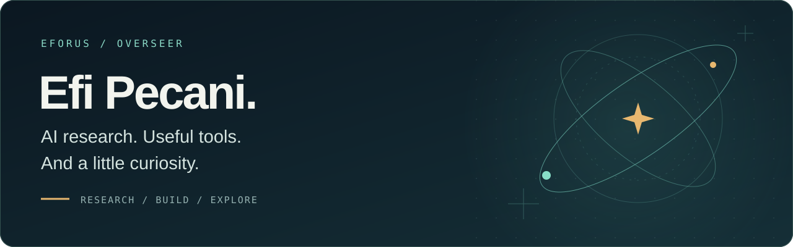
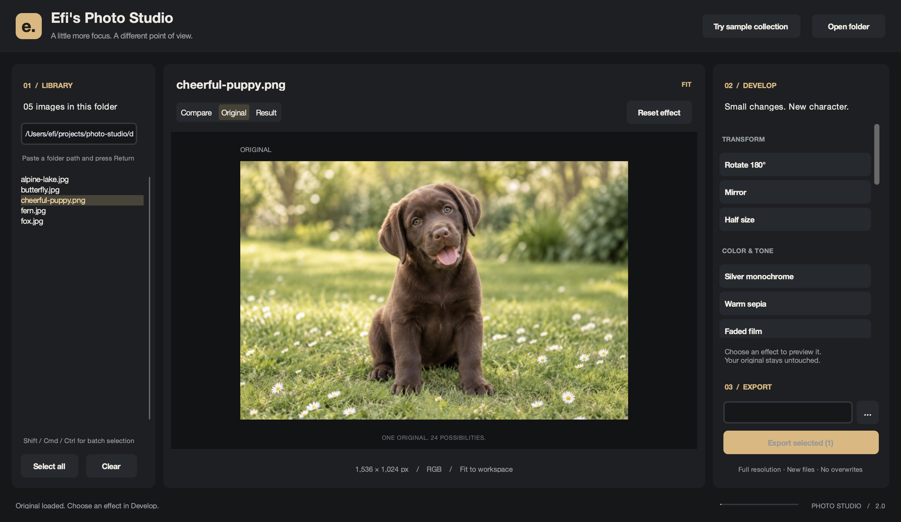

  

  <a href="https://www.linkedin.com/in/efipecani/">LinkedIn</a> &nbsp; / &nbsp;
  <a href="https://x.com/eforus_overseer">X</a> &nbsp; / &nbsp;
  <a href="https://github.com/eforus-overseer?tab=repositories">Explore the repositories</a>

### Hey, I'm Efi. 🖖

I'm an AI researcher and data engineer. I like turning interesting ideas into working experiments: training agents, investigating how language models fail, building security tools, and making things you can actually interact with.

I've been working with machine learning since before everything became “cool AI stuff.” The curiosity stuck. Give me a new method or tool and I'll probably build a proof of concept with it.

**My recurring interests:** language models · reinforcement learning · cybersecurity · data visualization

### A few things I've built

<table>
  <tr>
    <td width="42%">
      
    </td>
    <td>
      <strong><a href="https://github.com/eforus-overseer/photo-studio">Photo Studio</a></strong> 
      A photography playground with 24 desktop effects, foreground segmentation, and an interactive browser demo.  
      <a href="https://eforus-overseer.github.io/photo-studio/">Try the demo ↗</a> · <a href="https://github.com/eforus-overseer/photo-studio">Source</a> 
      Python · OpenCV · CustomTkinter · Canvas
    </td>
  </tr>
  <tr>
    <td width="42%">
      
    </td>
    <td>
      <strong><a href="https://github.com/eforus-overseer/propwash">PROP//WASH</a></strong> 
      FPV flight over real satellite terrain. Quaternion flight physics, race gates, and a whole lot of altitude.  
      <a href="https://github.com/eforus-overseer/propwash">Explore the simulator ↗</a> 
      JavaScript · Three.js · Terrain data
    </td>
  </tr>
  <tr>
    <td width="42%">
      
    </td>
    <td>
      <strong><a href="https://github.com/eforus-overseer/iron-tide-submarine">Iron Tide</a></strong> 
      A Silent Hunter–inspired submarine game. Hunt convoys, line up torpedoes, and evade destroyers in the browser.  
      <a href="https://github.com/eforus-overseer/iron-tide-submarine">Dive into the project ↗</a> 
      JavaScript · Three.js · Naval simulation
    </td>
  </tr>
</table>

### At the research bench

- **[Hallucination Sketches](https://github.com/eforus-overseer/llm-hallucination-sketches)** · Streaming LLM hallucination detection with compact sketch structures.
- **[Literary Data Poisoning](https://github.com/eforus-overseer/Literary-LLM-Knowledge-Data-Poisoning)** · Fine-tuning, literary style, and what happens when training data changes.
- **[LunarLander: DQN vs. PPO](https://github.com/eforus-overseer/LunarLander-DQN-vs-PPO)** · Implementing and comparing reinforcement learning agents in PyTorch and Gymnasium.
- **[Credential Stuffing Detection](https://github.com/eforus-overseer/Credential-Stuffing-Detection-Framework)** · Detecting automated login attacks.
- **[Octo Browser MCP](https://github.com/eforus-overseer/octobrowser-mcp)** · Browser profile management and automation through MCP.
- **[Visual Vocabulary](https://github.com/eforus-overseer/visual-vocabulary-skill)** · Choosing the right chart, with a 62-chart Matplotlib gallery.

### Tools I reach for

**Models & data** &nbsp; Python · PyTorch · scikit-learn · pandas · NumPy · OpenCV 
**Experiments & interfaces** &nbsp; Gymnasium · Matplotlib · Plotly · JavaScript · TypeScript · Three.js 
**Automation & infrastructure** &nbsp; Playwright · Docker · Git · AWS

<strong>A little history: from 2018 to now</strong>

My original [Photo Editor GUI](https://github.com/eforus-overseer/Photo-Editor-GUI) was written entirely by hand in 2018, before today's AI coding assistants. It's preserved as a legacy project.

[Photo Studio](https://github.com/eforus-overseer/photo-studio) revisits that idea with an AI-assisted development workflow, a redesigned interface, more effects, and segmentation. Same curiosity, new tools. Also, a much cuter Labrador.

---

Research it. Build it. See what happens.

